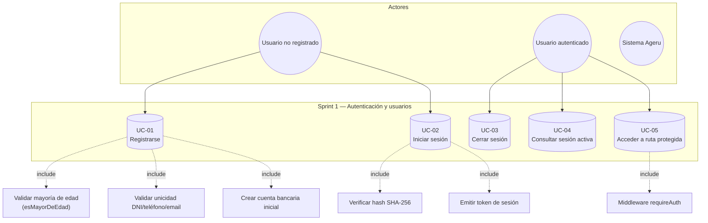

# Sprint 1 — Diagrama de casos de uso (Autenticación)

**Objetivo del sprint:** Registro de usuarios, autenticación con token y middlewares de seguridad.

**Requerimientos cubiertos:** RF01–RF04, RF09, RF11–RF12 (cuenta automática al registrar).

## Diagrama



## Actores y casos de uso

| ID | Caso de uso | Actor | Implementación |
|----|-------------|-------|----------------|
| UC-01 | Registrarse | Usuario no registrado | `POST /api/auth/register` → `auth.controller.register` → `auth.service.register` → `auth.repository.createUserWithCredentials` |
| UC-02 | Iniciar sesión | Usuario no registrado | `POST /api/auth/login` → `auth.service.login` |
| UC-03 | Cerrar sesión | Usuario autenticado | `POST /api/auth/logout` → `auth.service.logout` (elimina token de `activeSessions`) |
| UC-04 | Consultar sesión | Usuario autenticado | `GET /api/auth/me` con header Bearer |
| UC-05 | Acceder a ruta protegida | Usuario autenticado | `authGuard` (Angular) + `requireAuth` (Express) |

## Comentarios sobre funciones clave

### `auth.service.register(payload)`
1. Valida campos requeridos (`username`, `password`, `dni`, `telefono`, etc.).
2. Llama a **`esMayorDeEdad(fechaNacimiento)`** — calcula edad comparando fecha de nacimiento con hoy; retorna `false` si es menor de 18 (RF09).
3. Llama a **`authRepository.findAuthByUsername`** — evita duplicados de username.
4. Llama a **`authRepository.createUserWithCredentials`** — transacción SQL atómica que inserta en `usuarios`, `auth_credenciales` y `cuentas`.

### `auth.service.login({ username, password })`
1. Normaliza username a minúsculas.
2. Llama a **`authRepository.findAuthByUsername`** — obtiene usuario + hash.
3. Llama a **`authRepository.hashPassword(password)`** — SHA-256 del password ingresado; compara con el hash almacenado.
4. Genera token con **`crypto.randomBytes(24).toString('hex')`** y lo guarda en **`activeSessions.set(token, user)`**.

### `requireAuth(req, res, next)` (`middlewares/require-auth.js`)
1. Extrae token del header: `Authorization: Bearer <token>`.
2. Llama a **`getUserByToken(token)`** del auth service — busca en el `Map` en memoria.
3. Si es válido, adjunta `req.user` y `req.token`; si no, responde **401**.

### `authGuard` (`frontend/core/guards/auth.guard.ts`)
1. Llama a **`AuthService.checkSession()`** — hace `GET /api/auth/me` con el token de `localStorage`.
2. Si la sesión es válida permite navegar; si no, redirige a `/login`.

## Prompt alternativo (para otra IA o herramienta UML)

```
Genera un diagrama de casos de uso UML para el Sprint 1 de Ageru (fintech Perú):

Actores: Usuario no registrado, Usuario autenticado, Sistema.
Casos: Registrarse (validar edad >18, DNI/teléfono únicos, crear cuenta), Iniciar sesión (SHA-256 + token en memoria), Cerrar sesión, Consultar perfil (/me), Acceder a rutas protegidas (middleware Bearer).
Relaciones include: Registrarse incluye crear cuenta en SQL Server; Iniciar sesión incluye emitir token opaco; Acceder incluye validar requireAuth.
Stack: Angular SPA + Express + SQL Server.
Estilo: UML estándar, fondo blanco, español.
```
