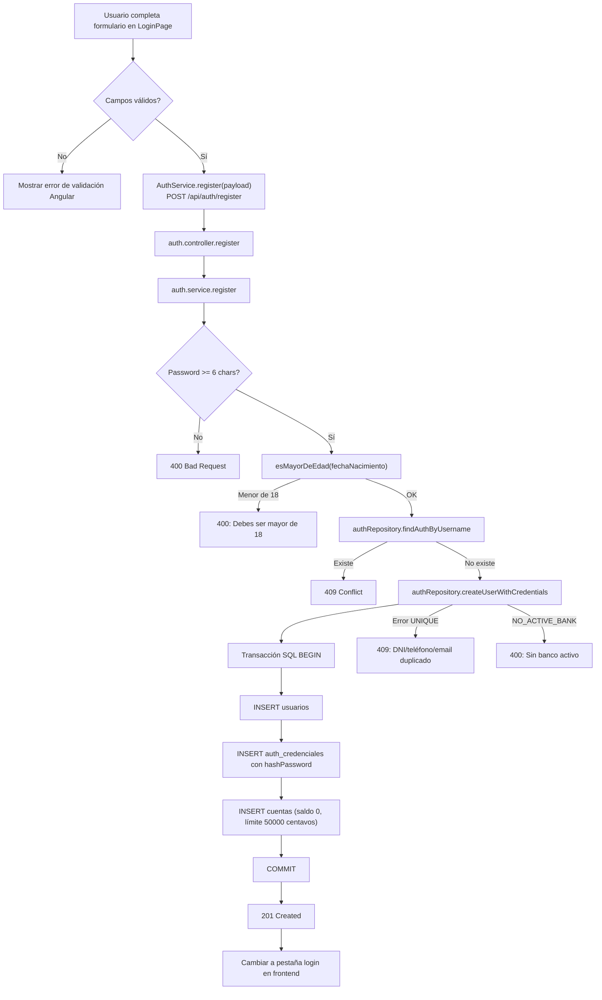
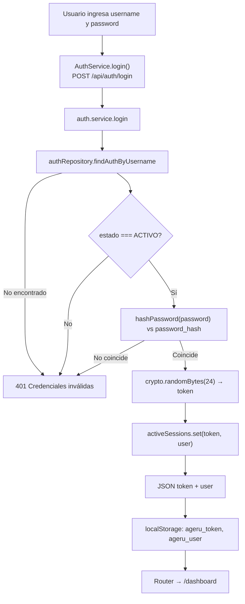
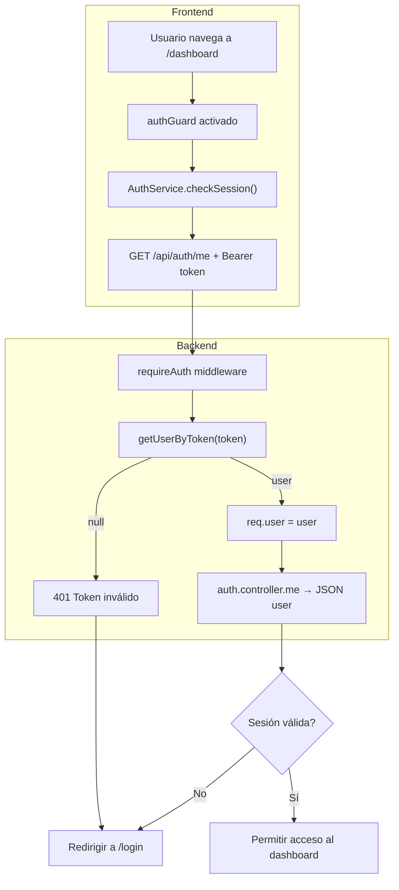
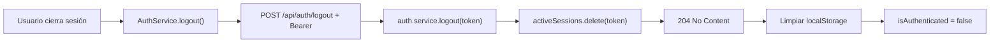

# Sprint 1 — Diagrama de flujos (Autenticación)

## Flujo 1: Registro de usuario



**Cómo se hashea la contraseña:**
```javascript
// auth.repository.js — hashPassword(password)
crypto.createHash('sha256').update(password).digest('hex')
```

---

## Flujo 2: Inicio de sesión



---

## Flujo 3: Protección de rutas



---

## Flujo 4: Cierre de sesión



## Archivos involucrados

| Capa | Archivo | Rol |
|------|---------|-----|
| Vista | `frontend/.../login.page.ts` | Formularios login/registro |
| Servicio FE | `frontend/.../auth.service.ts` | HTTP + localStorage + signals |
| Guard | `frontend/.../auth.guard.ts` | Protección de rutas Angular |
| Ruta | `backend/.../auth.routes.js` | Endpoints `/register`, `/login`, `/me`, `/logout` |
| Controlador | `backend/.../auth.controller.js` | Traduce HTTP ↔ service |
| Servicio BE | `backend/.../auth.service.js` | Lógica de negocio y sesiones |
| Repositorio | `backend/.../auth.repository.js` | SQL: usuarios + credenciales + cuenta |
| Middleware | `backend/.../require-auth.js` | Valida token en rutas protegidas |
