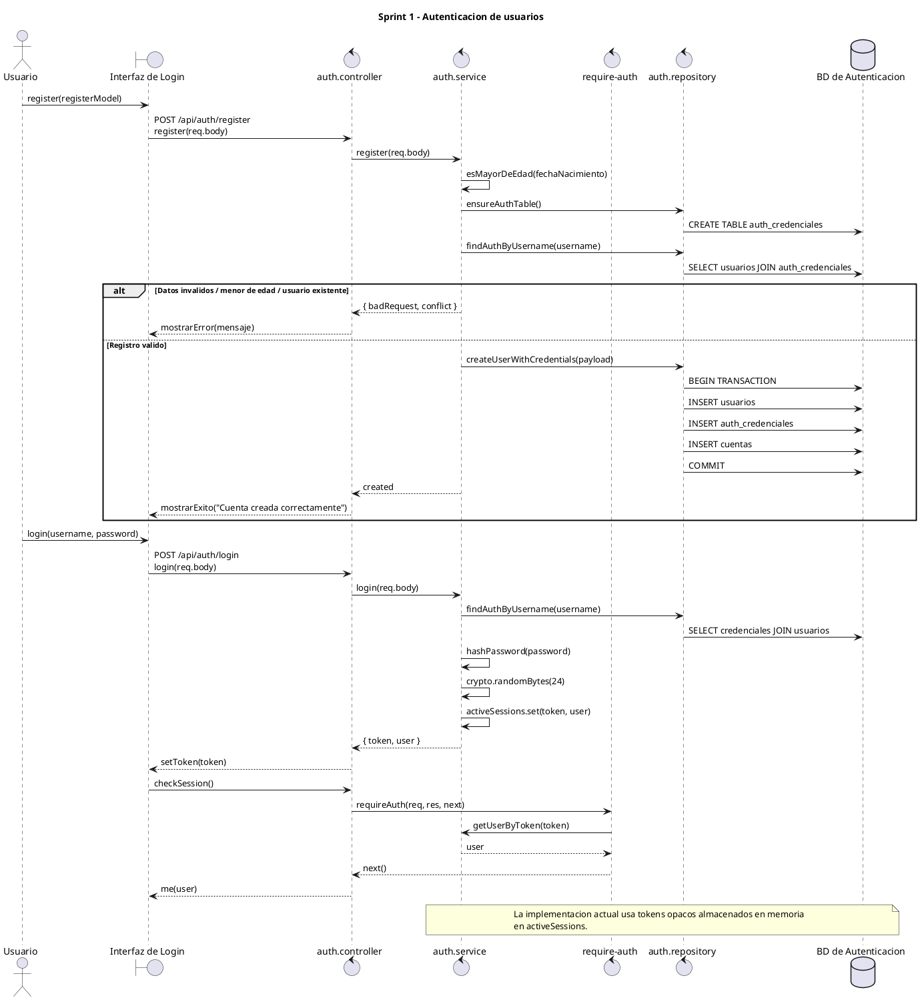

# Sprint 1 - Diagrama de secuencia UML

Flujo principal de autenticacion con registro, inicio de sesion y validacion de sesion activa.

```plantuml
@startuml
title Sprint 1 - Autenticacion de usuarios

actor Usuario as U
boundary "Interfaz de Login" as UI
control "auth.controller" as AC
control "auth.service" as AS
control "require-auth" as MW
control "auth.repository" as AR
database "BD de Autenticacion" as DB

U -> UI : register(registerModel)
UI -> AC : POST /api/auth/register\nregister(req.body)
AC -> AS : register(req.body)
AS -> AS : esMayorDeEdad(fechaNacimiento)
AS -> AR : ensureAuthTable()
AR -> DB : CREATE TABLE auth_credenciales
AS -> AR : findAuthByUsername(username)
AR -> DB : SELECT usuarios JOIN auth_credenciales

alt Datos invalidos / menor de edad / usuario existente
  AS --> AC : { badRequest, conflict }
  AC --> UI : mostrarError(mensaje)
else Registro valido
  AS -> AR : createUserWithCredentials(payload)
  AR -> DB : BEGIN TRANSACTION
  AR -> DB : INSERT usuarios
  AR -> DB : INSERT auth_credenciales
  AR -> DB : INSERT cuentas
  AR -> DB : COMMIT
  AS --> AC : created
  AC --> UI : mostrarExito("Cuenta creada correctamente")
end

U -> UI : login(username, password)
UI -> AC : POST /api/auth/login\nlogin(req.body)
AC -> AS : login(req.body)
AS -> AR : findAuthByUsername(username)
AR -> DB : SELECT credenciales JOIN usuarios
AS -> AS : hashPassword(password)
AS -> AS : crypto.randomBytes(24)
AS -> AS : activeSessions.set(token, user)
AS --> AC : { token, user }
AC --> UI : setToken(token)

UI -> AC : checkSession()
AC -> MW : requireAuth(req, res, next)
MW -> AS : getUserByToken(token)
AS --> MW : user
MW --> AC : next()
AC --> UI : me(user)

note over AS,DB
La implementacion actual usa tokens opacos almacenados en memoria
en activeSessions.
end note
@enduml
```
