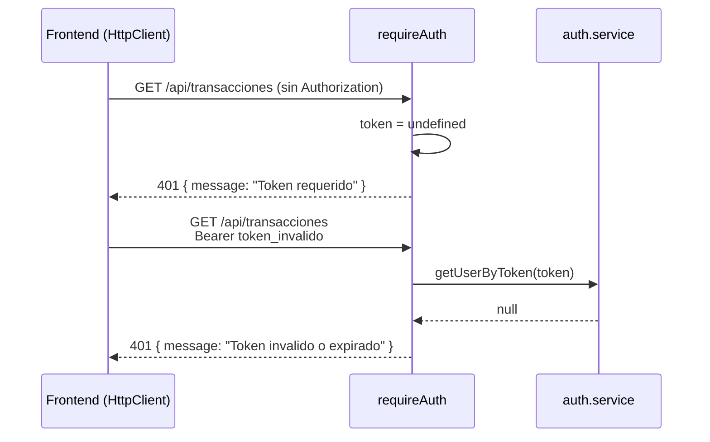

# Sprint 1 — Diagrama de secuencia (Autenticación)

## Secuencia: Registro de usuario

```mermaid
sequenceDiagram
    actor U as Usuario
    participant LP as LoginPage
    participant AS as AuthService (Angular)
    participant API as auth.controller
    participant SVC as auth.service
    participant REPO as auth.repository
    participant DB as SQL Server

    U->>LP: Completa formulario registro
    LP->>AS: register(registerModel)
    Note over AS: HttpClient.post('/api/auth/register')

    AS->>API: POST /api/auth/register {payload}
    API->>SVC: register(req.body)

    SVC->>SVC: esMayorDeEdad(fechaNacimiento)
    Note over SVC: Calcula edad; RF09 — rechaza si < 18

    SVC->>REPO: ensureAuthTable()
    SVC->>REPO: findAuthByUsername(username)
    REPO->>DB: SELECT auth_credenciales + usuarios
    DB-->>REPO: null (no existe)

    SVC->>REPO: createUserWithCredentials(payload)
    REPO->>DB: BEGIN TRANSACTION
    REPO->>DB: SELECT banco ACTIVO
    REPO->>DB: INSERT usuarios
    REPO->>DB: INSERT auth_credenciales (hashPassword)
    Note over REPO: hashPassword usa crypto.createHash('sha256')
    REPO->>DB: INSERT cuentas (saldo_centavos=0, limite=50000)
    REPO->>DB: COMMIT
    DB-->>REPO: { usuarioId, username, role }
    REPO-->>SVC: created
    SVC-->>API: created
    API-->>AS: 201 { message, user }
    AS-->>LP: success
    LP-->>U: "Cuenta creada. Inicia sesión."
```

---

## Secuencia: Login y acceso a ruta protegida

```mermaid
sequenceDiagram
    actor U as Usuario
    participant LP as LoginPage
    participant AS as AuthService (Angular)
    participant API as Express
    participant AUTH as auth.service
    participant REPO as auth.repository
    participant MW as requireAuth
    participant DB as SQL Server

    U->>LP: username + password
    LP->>AS: login(username, password)
    AS->>API: POST /api/auth/login

    API->>AUTH: login({ username, password })
    AUTH->>REPO: findAuthByUsername(username)
    REPO->>DB: SELECT credenciales JOIN usuarios
    DB-->>REPO: userRecord

    AUTH->>REPO: hashPassword(password)
    Note over AUTH: Compara hash recibido vs almacenado
    AUTH->>AUTH: crypto.randomBytes(24) → token
    AUTH->>AUTH: activeSessions.set(token, user)
    AUTH-->>API: { token, user }
    API-->>AS: 200 JSON
    AS->>AS: localStorage.setItem('ageru_token', token)
    AS-->>LP: OK
    LP->>LP: router.navigate('/dashboard')

    Note over U,DB: --- Acceso posterior a ruta protegida ---

    LP->>AS: checkSession() vía authGuard
    AS->>API: GET /api/auth/me<br/>Authorization: Bearer token
    API->>MW: requireAuth(req, res, next)
    MW->>AUTH: getUserByToken(token)
    Note over AUTH: activeSessions.get(token)
    AUTH-->>MW: user
    MW->>MW: req.user = user; next()
    API-->>AS: { user }
    AS-->>LP: isAuthenticated = true
```

---

## Secuencia: Intento sin token (401)



## Notas de implementación

| Paso | Función | Qué hace |
|------|---------|----------|
| Validar edad | `esMayorDeEdad()` en `auth.service.js` | Resta años de `fecha_nacimiento`; ajusta si aún no cumplió años en el mes/día actual |
| Hash password | `hashPassword()` en `auth.repository.js` | SHA-256 hex de la contraseña en texto plano |
| Crear cuenta | `createUserWithCredentials()` | Transacción SQL: usuario + credenciales + cuenta con banco activo por defecto |
| Sesión | `activeSessions` Map | Token opaco → objeto `{ usuarioId, username, name, role }`. **Se pierde al reiniciar el servidor** |
| Guard Angular | `authGuard` | Llama `checkSession()` antes de activar rutas hijas de `/dashboard` |
