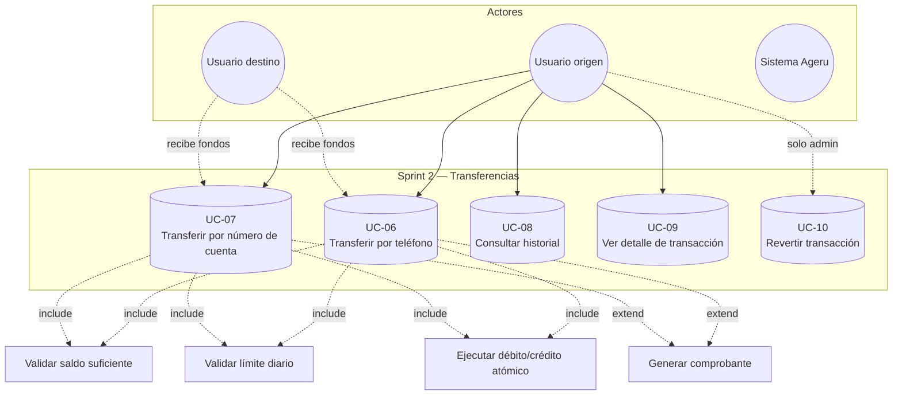

# Sprint 2 — Diagrama de casos de uso (Transferencias)

**Objetivo del sprint:** Lógica de transferencias inmediatas con montos almacenados en centavos (`BIGINT`).

**Requerimientos cubiertos:** RF11, RF14–RF16, RF19, RF21–RF25, RF28–RF29, RF31, RF34–RF36.

## Diagrama



## Casos de uso detallados

| ID | Caso de uso | Endpoint | Service |
|----|-------------|----------|---------|
| UC-06 | Transferir por teléfono | `POST /api/transacciones/transferir` `{ telefono, montoCentavos }` | `transacciones.service.transferir` |
| UC-07 | Transferir por cuenta | `POST /api/transacciones/transferir` `{ numeroCuenta, montoCentavos }` | `transacciones.service.transferir` |
| UC-08 | Listar transacciones | `GET /api/transacciones?tipo&fechaDesde&fechaHasta` | `transacciones.service.listar` |
| UC-09 | Detalle | `GET /api/transacciones/:id` | `transacciones.service.detalle` |
| UC-10 | Revertir (admin) | `POST /api/transacciones/:id/revertir` | `transacciones.service.revertir` |

## Comentarios sobre funciones clave

### `transferencias.page.ts → transferir()`
- Convierte soles a centavos: **`Math.round(montoSoles * 100)`** — evita decimales flotantes en el cliente.
- Llama a **`AuthService.getAuthHeaders()`** — adjunta `Authorization: Bearer <token>`.
- **`HttpClient.post('/api/transacciones/transferir', payload)`**.

### `transacciones.service.transferir(usuarioId, payload)`
1. **`parseMontoCentavos(payload.montoCentavos)`** — valida entero positivo seguro (`Number.isSafeInteger`).
2. **`cuentasRepository.findCuentaPrincipal(usuarioId)`** — obtiene cuenta origen del usuario logueado.
3. Resuelve destino según payload:
   - `telefono` → **`transaccionesRepository.findCuentaByTelefono`** (RF24)
   - `numeroCuenta` → **`findCuentaByNumeroCuenta`** (RF25)
   - `cuentaDestinoId` → **`findCuentaById`**
4. **`validarTransferencia({ cuentaOrigen, cuentaDestino, montoCentavos })`**:
   - Cuentas activas (RF16, RF31)
   - No misma cuenta
   - **`saldo_centavos >= montoCentavos`** (RF21)
   - **`getSumaTxHoy + monto <= limite_diario_centavos`** (RF23)
5. **`transaccionesRepository.ejecutarTransferencia(...)`** — transacción SQL atómica.
6. **`buildTransferResponse(...)`** — arma comprobante + notificación.

### `transaccionesRepository.ejecutarTransferencia(...)`
Operación **atómica** con `sql.Transaction`:
1. `UPDATE cuentas SET saldo_centavos = saldo_centavos - @monto WHERE saldo >= @monto` (origen)
2. `UPDATE cuentas SET saldo_centavos = saldo_centavos + @monto` (destino)
3. `INSERT transacciones` tipo `TRANSFERENCIA`, estado `COMPLETADA` (RF22, RF36)
4. Monto como **`sql.BigInt`** — centavos sin error de precisión

## Prompt alternativo

```
Diagrama UML de casos de uso — Sprint 2 Ageru (transferencias P2P):
Actor principal: Usuario autenticado. Actor secundario: Usuario destinatario.
Casos: Transferir por teléfono, Transferir por número de cuenta enmascarado, Listar historial con filtros, Ver detalle, Revertir (solo admin).
Includes: validar saldo BIGINT centavos, validar límite diario, operación atómica débito-crédito SQL Server.
Montos: S/ 10.50 = 1050 centavos. Comprobante con referencia TX-{timestamp}-{hex}.
```
