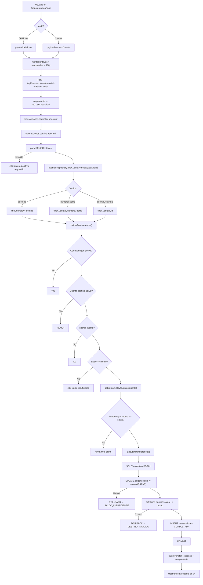
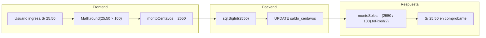
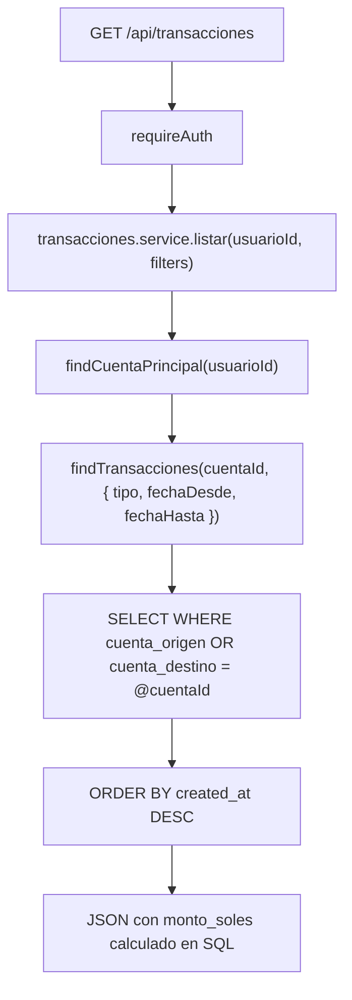
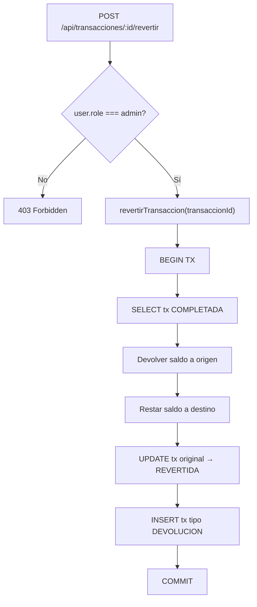

# Sprint 2 — Diagrama de flujos (Transferencias)

## Flujo principal: Transferencia P2P

---

## Flujo: Conversión de montos (centavos)

> **Por qué centavos:** SQL Server almacena `saldo_centavos` y `monto_centavos` como `BIGINT`. Evita errores de redondeo de `float`/`decimal` en operaciones encadenadas (documentado en sección 5.2 del informe).

---

## Flujo: Consulta de historial

---

## Flujo: Reversión (admin)

## Tabla de validaciones (`validarTransferencia`)

| Validación | RF | Mensaje de error |
|------------|-----|------------------|
| Cuenta origen existe | — | Cuenta origen no encontrada |
| Cuenta destino existe | — | Cuenta destino no encontrada |
| Origen ACTIVA | RF16 | La cuenta origen no está activa |
| Destino ACTIVA + usuario ACTIVO | RF31 | La cuenta destino no está activa |
| Origen ≠ destino | — | No puedes transferir a tu misma cuenta |
| Saldo suficiente | RF21 | Saldo insuficiente |
| Límite diario | RF23 | La transferencia supera tu límite diario |
