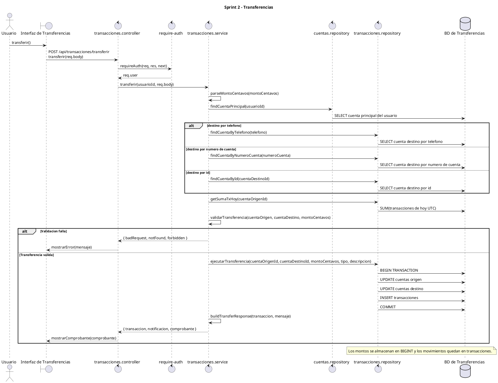

# Sprint 2 - Diagrama de secuencia UML

Flujo principal de transferencias usando telefono, numero de cuenta y comprobante.

```plantuml
@startuml
title Sprint 2 - Transferencias

actor Usuario as U
boundary "Interfaz de Transferencias" as UI
control "transacciones.controller" as TC
control "require-auth" as MW
control "transacciones.service" as TS
control "cuentas.repository" as CR
control "transacciones.repository" as TR
database "BD de Transferencias" as DB

U -> UI : transferir()
UI -> TC : POST /api/transacciones/transferir\ntransferir(req.body)
TC -> MW : requireAuth(req, res, next)
MW --> TC : req.user
TC -> TS : transferir(usuarioId, req.body)
TS -> TS : parseMontoCentavos(montoCentavos)
TS -> CR : findCuentaPrincipal(usuarioId)
CR -> DB : SELECT cuenta principal del usuario

alt destino por telefono
  TS -> TR : findCuentaByTelefono(telefono)
  TR -> DB : SELECT cuenta destino por telefono
else destino por numero de cuenta
  TS -> TR : findCuentaByNumeroCuenta(numeroCuenta)
  TR -> DB : SELECT cuenta destino por numero de cuenta
else destino por id
  TS -> TR : findCuentaById(cuentaDestinoId)
  TR -> DB : SELECT cuenta destino por id
end

TS -> TR : getSumaTxHoy(cuentaOrigenId)
TR -> DB : SUM(transacciones de hoy UTC)
TS -> TS : validarTransferencia(cuentaOrigen, cuentaDestino, montoCentavos)

alt Validacion falla
  TS --> TC : { badRequest, notFound, forbidden }
  TC --> UI : mostrarError(mensaje)
else Transferencia valida
  TS -> TR : ejecutarTransferencia(cuentaOrigenId, cuentaDestinoId, montoCentavos, tipo, descripcion)
  TR -> DB : BEGIN TRANSACTION
  TR -> DB : UPDATE cuentas origen
  TR -> DB : UPDATE cuentas destino
  TR -> DB : INSERT transacciones
  TR -> DB : COMMIT
  TS -> TS : buildTransferResponse(transaccion, mensaje)
  TS --> TC : { transaccion, notificacion, comprobante }
  TC --> UI : mostrarComprobante(comprobante)
end

note over TR,DB
Los montos se almacenan en BIGINT y los movimientos quedan en transacciones.
end note
@enduml
```
