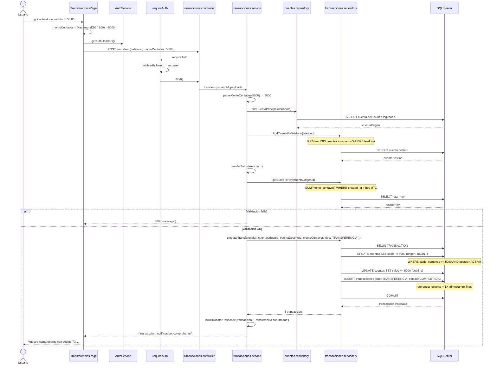
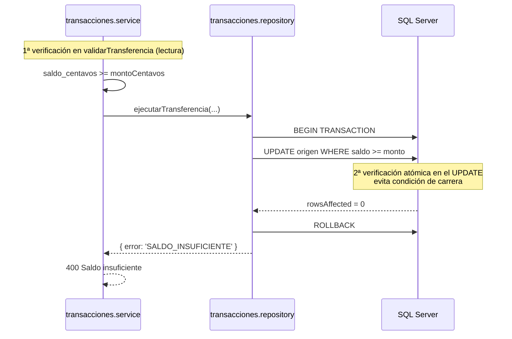
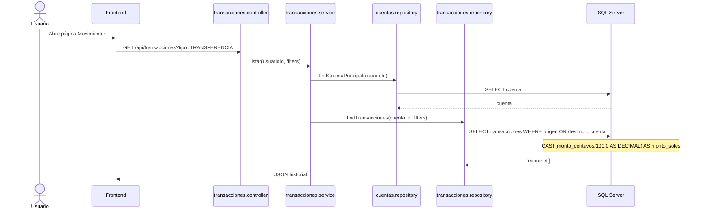

# Sprint 2 — Diagrama de secuencia (Transferencias)

## Secuencia: Transferencia por teléfono

---

## Secuencia: Fallo por saldo insuficiente (doble verificación)

> La validación previa mejora la UX (error rápido); el `UPDATE ... WHERE saldo >= @monto` garantiza consistencia bajo concurrencia.

---

## Secuencia: Listar movimientos

## Referencia rápida de funciones

| Función | Archivo | Descripción |
|---------|---------|-------------|
| `transferir()` | `transacciones.service.js` | Orquesta validación + ejecución |
| `validarTransferencia()` | `transacciones.service.js` | Reglas de negocio pre-transacción |
| `parseMontoCentavos()` | `transacciones.service.js` | Valida entero positivo seguro |
| `findCuentaByTelefono()` | `transacciones.repository.js` | Busca destino por celular (RF24) |
| `getSumaTxHoy()` | `transacciones.repository.js` | Suma gastos del día UTC (RF23) |
| `ejecutarTransferencia()` | `transacciones.repository.js` | TX SQL: débito + crédito + INSERT |
| `buildTransferResponse()` | `transacciones.service.js` | Formatea comprobante y notificación |
