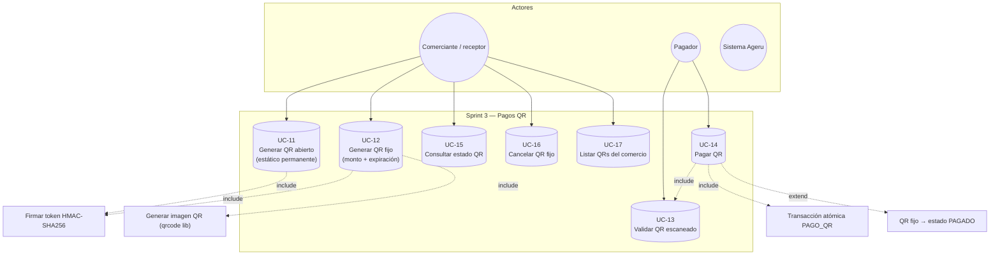

# Sprint 3 — Diagrama de casos de uso (Pagos QR)

**Objetivo del sprint:** Generación y escaneo de códigos QR estáticos (abiertos) y dinámicos (fijos).

**Requerimientos cubiertos:** RF37–RF46 (parcial RF46 con firma HMAC del enlace).

## Diagrama



## Tipos de QR en Ageru

| Tipo | Código | Monto | Expiración | Uso |
|------|--------|-------|------------|-----|
| **ABIERTO** | `tipoQr: 'ABIERTO'` | Lo ingresa el pagador | Permanente (`9999-12-31`) | QR personal del comerciante; reutilizable |
| **FIJO** | `tipoQr: 'FIJO'` | Predefinido en centavos | `expiraMinutos` (default 30) | Cobro por monto exacto; un solo pago |

## Casos de uso y endpoints

| ID | Caso de uso | Método | Ruta |
|----|-------------|--------|------|
| UC-11 | Generar/ver QR abierto | POST | `/api/pagos-qr` `{ tipoQr: 'ABIERTO' }` |
| UC-12 | Generar QR fijo | POST | `/api/pagos-qr` `{ tipoQr: 'FIJO', comercioId, montoCentavos, expiraMinutos }` |
| UC-13 | Validar QR | POST | `/api/pagos-qr/validar` `{ codigoQr }` |
| UC-14 | Pagar QR | POST | `/api/pagos-qr/pagar` `{ codigoQr, montoCentavos? }` |
| UC-15 | Estado de un QR | GET | `/api/pagos-qr/:id` |
| UC-16 | Cancelar QR fijo | POST | `/api/pagos-qr/:id/cancelar` |
| UC-17 | Listar QRs | GET | `/api/pagos-qr` |

## Comentarios sobre funciones clave

### `pagos-qr.service.crear(usuarioId, payload)`
1. Valida `tipoQr` ∈ `{ FIJO, ABIERTO }`.
2. Para **FIJO**: exige `comercioId` y `montoCentavos > 0` (RF37, RF45).
3. Para **ABIERTO**: si ya existe uno activo, retorna el existente (`findOpenByCuentaDestino`).
4. **`signToken({ jti, cuentaDestinoId, tipo, iat })`** — firma HMAC-SHA256 con `QR_SECRET` (RF46).
5. Construye código: **`ageru://qr/${token}`**.
6. **`pagosQrRepository.createPagoQr(...)`** — INSERT en tabla `pagos_qr` estado `PENDIENTE`.
7. **`enrichQr(pagoQr)`** — llama **`QRCode.toDataURL(codigo_qr)`** para generar imagen base64.

### `pagos-qr.service.validar(codigoQr)`
1. **`getTokenFromCodigo`** — extrae token del URI `ageru://qr/...`.
2. **`verifyToken(token)`** — verifica firma HMAC con `crypto.timingSafeEqual`.
3. **`pagosQrRepository.findByCodigo`** — busca en BD; ejecuta **`expirarPendientes()`** antes (RF40).

### `pagos-qr.service.pagar(usuarioId, payload)`
1. Reutiliza **`validar(codigoQr)`** — verifica firma + existencia + estado PENDIENTE.
2. Determina monto: fijo usa `monto_centavos` del QR; abierto usa `payload.montoCentavos`.
3. Valida límite diario vía **`transaccionesRepository.getSumaTxHoy`**.
4. **`pagosQrRepository.pagar(...)`** — transacción SQL con `UPDLOCK` (evita doble pago).

### `pagosQrRepository.pagar(...)` (atómico)
1. `SELECT pagos_qr WITH (UPDLOCK, ROWLOCK)` — bloqueo de fila.
2. Verifica expiración (solo FIJO).
3. Valida monto coincide (FIJO) o es positivo (ABIERTO).
4. Débito origen + crédito destino (BIGINT centavos).
5. `INSERT transacciones` tipo **`PAGO_QR`**, estado **`COMPLETADA`**.
6. Si FIJO: `UPDATE pagos_qr SET estado = 'PAGADO', transaccion_id = ...`.
7. Si ABIERTO: **no cambia estado** — el QR sigue disponible para más pagos.

## Prompt alternativo

```
Diagrama UML casos de uso — Sprint 3 Ageru (pagos QR):
Actores: Comerciante (genera QR), Pagador (escanea y paga).
Casos: QR abierto permanente (sin monto), QR fijo con monto y expiración, Validar enlace ageru://qr/{token}, Pagar, Cancelar, Listar historial.
Includes: firma HMAC-SHA256 del token, validación expiración, transacción SQL PAGO_QR.
QR abierto reutilizable; QR fijo pasa a PAGADO tras un pago.
Librería qrcode genera imagen DataURL.
```
