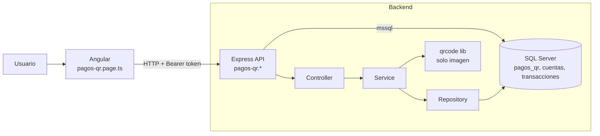
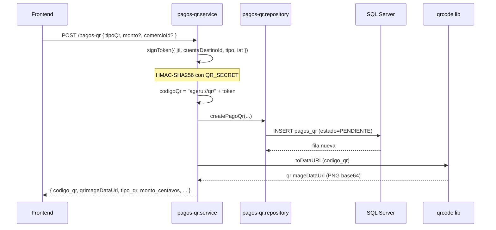
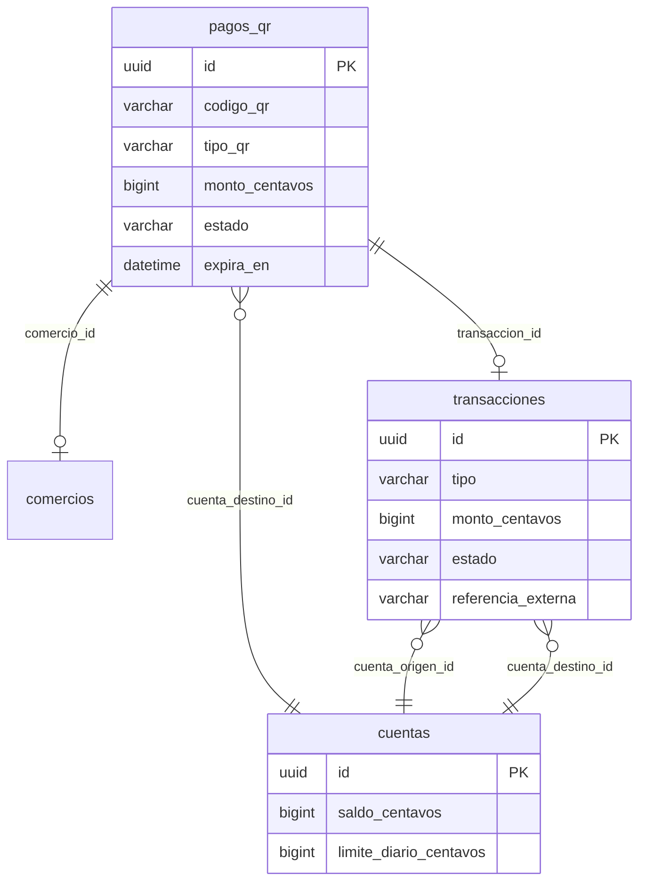

# Sprint 3 — Cómo funciona Pagos QR (guía para la expo)

Documento explicativo del **Sprint 3**: qué hace, cómo se conectan Frontend, Backend y Base de datos, qué hace la librería `qrcode`, y qué función llama a qué endpoint.

> **Resumen en una frase:** el QR es una **imagen** que codifica un **enlace firmado** (`ageru://qr/...`); los **datos reales** (monto, cuenta destino, estado) viven en **SQL Server**. La librería solo dibuja el QR; no guarda nada.

---

## 1. ¿Qué problema resuelve este sprint?

Permite que un comerciante **cobre digitalmente** mostrando un código QR, y que otro usuario **pague escaneando o pegando** ese código en la app.

Hay **dos tipos de QR**:

| Tipo | Quién lo usa | Monto | ¿Expira? | ¿Se puede pagar varias veces? |
|------|--------------|-------|----------|-------------------------------|
| **ABIERTO** | QR personal del comerciante | Lo pone el pagador al pagar | No (permanente) | **Sí** — queda en `PENDIENTE` |
| **FIJO** | Cobro por venta concreta | Fijo al crearlo (ej. S/ 12.00) | Sí (`expiraMinutos`, default 30 min) | **No** — pasa a `PAGADO` tras un pago |

**Archivos principales del sprint:**

| Capa | Ruta |
|------|------|
| Pantalla Angular | `frontend/src/app/features/pagos-qr/pages/pagos-qr.page.ts` |
| Rutas API | `backend/src/modules/pagos-qr/pagos-qr.routes.js` |
| Controlador | `backend/src/modules/pagos-qr/pagos-qr.controller.js` |
| Lógica de negocio | `backend/src/modules/pagos-qr/pagos-qr.service.js` |
| Acceso a BD | `backend/src/modules/pagos-qr/pagos-qr.repository.js` |

---

## 2. Arquitectura en 4 capas



**Flujo estándar de una petición:**

1. El usuario hace clic en un botón en Angular.
2. Angular llama `HttpClient` con `Authorization: Bearer <token>` (vía `AuthService.getAuthHeaders()`).
3. Express pasa por `requireAuth` (Sprint 1): si no hay sesión válida, responde 401.
4. El **controller** recibe la petición y llama al **service**.
5. El **service** aplica reglas de negocio (firma HMAC, montos, límites).
6. El **repository** ejecuta SQL en SQL Server.
7. La respuesta JSON vuelve al Frontend y actualiza la pantalla (`signal(...)`).

---

## 3. La librería `qrcode` — ¿qué hace y qué NO hace?

**Paquete:** `qrcode` v1.5.4 (instalado en el backend, `backend/package.json`).

**Dónde se usa:** solo en `pagos-qr.service.js`, función `enrichQr()`:

```js
const qrImageDataUrl = await QRCode.toDataURL(pagoQr.codigo_qr, {
  errorCorrectionLevel: 'M',
  margin: 1,
  width: 280
});
```

### Lo que SÍ hace la librería

- Toma el **texto** del código (ej. `ageru://qr/eyJqdGki...abc123`) y genera una **imagen PNG en base64** (`data:image/png;base64,...`).
- Esa imagen se envía al Frontend en el campo `qrImageDataUrl` para mostrarla en un ``.

### Lo que NO hace la librería

- **No guarda datos** en base de datos.
- **No valida** si el QR es válido o está expirado.
- **No procesa pagos**.
- **No genera el enlace** — el enlace lo crea el backend con `signToken()` antes de llamar a `QRCode.toDataURL`.

> **Para la expo:** piensa en `qrcode` como una **impresora**: convierte el enlace en cuadritos; la **verdad del negocio** está en la BD.

---

## 4. ¿Cómo funciona el “código QR”? ¿Es solo un link?

**Sí, el contenido del QR es un enlace**, pero no es un link suelto: es un **enlace firmado criptográficamente** que apunta a un **registro en la base de datos**.

### Paso a paso al crear un QR



**Ejemplo de código guardado:**

```
ageru://qr/eyJqdGkiOiIuLi4ifQ.signature_hmac_sha256
         └─ payload en base64url ─┘ └─ firma ─┘
```

**Qué se guarda en la tabla `pagos_qr`:**

| Campo | Ejemplo | Significado |
|-------|---------|-------------|
| `codigo_qr` | `ageru://qr/...` | Enlace completo (es lo que va dentro del QR) |
| `cuenta_destino_id` | UUID | Cuenta que **recibe** el dinero |
| `comercio_id` | UUID o NULL | Comercio (solo QR fijo; abierto puede ser NULL) |
| `tipo_qr` | `ABIERTO` / `FIJO` | Tipo de cobro |
| `monto_centavos` | `1200` o NULL | Monto fijo en centavos; NULL si es abierto |
| `estado` | `PENDIENTE` | `PENDIENTE`, `PAGADO`, `EXPIRADO`, `CANCELADO` |
| `expira_en` | fecha UTC | Fijos expiran; abiertos usan fecha lejana |

**Conclusión:** el link **identifica** el cobro; la BD **almacena** monto, destino, estado y expiración. Al validar o pagar, el backend **verifica la firma del token** y **busca la fila** por `codigo_qr`.

---

## 5. Frontend: cada botón y qué llama al backend

Archivo: `pagos-qr.page.ts`. Todas las llamadas usan:

```ts
this.http.<metodo>(`${environment.apiBaseUrl}/pagos-qr/...`, body, {
  headers: this.authService.getAuthHeaders()  // Authorization: Bearer ...
})
```

### Al entrar a la página (`ngOnInit` → `cargarBase()`)

| Acción automática | Método | Endpoint | Para qué |
|-------------------|--------|----------|----------|
| Cargar comercios (select QR fijo) | `GET` | `/api/pagos-qr/comercios` | Lista comercios activos |
| Cargar historial | `GET` | `/api/pagos-qr` | Lista QRs del usuario |
| Crear/ver QR abierto | `POST` | `/api/pagos-qr` `{ tipoQr: 'ABIERTO' }` | Si no tiene QR abierto, lo crea; si ya existe, lo devuelve |

### Panel “Mi QR abierto / fijo”

| Botón / acción | Función TS | Método | Endpoint | Body enviado |
|----------------|------------|--------|----------|--------------|
| **Ver mi QR** (modo Abierto) | `crearQr()` | `POST` | `/api/pagos-qr` | `{ tipoQr: 'ABIERTO' }` |
| **Generar QR fijo** | `crearQr()` | `POST` | `/api/pagos-qr` | `{ tipoQr: 'FIJO', comercioId, montoCentavos, expiraMinutos }` |

**Respuesta esperada:** JSON con `codigo_qr`, `qrImageDataUrl`, `tipo_qr`, `estado`, etc. El Frontend guarda eso en `qrGenerado` y muestra la imagen.

### Panel “Pagar QR”

| Botón | Función TS | Método | Endpoint | Body |
|-------|------------|--------|----------|------|
| **Validar** | `validarQr()` | `POST` | `/api/pagos-qr/validar` | `{ codigoQr: "ageru://qr/..." }` |
| **Pagar QR** | `pagarQr()` | `POST` | `/api/pagos-qr/pagar` | `{ codigoQr, montoCentavos }` |

- El usuario pega el enlace en el textarea (o lo trae del QR generado).
- **Validar** no mueve dinero: solo consulta y muestra comercio, monto y estado.
- **Pagar** sí ejecuta la transacción financiera.

### Historial “QR disponibles”

| Acción | Función TS | Método | Endpoint |
|--------|------------|--------|----------|
| Recargar lista | `cargarQrs()` | `GET` | `/api/pagos-qr` |
| **Cancelar** (solo QR fijo pendiente) | `cancelar(id)` | `POST` | `/api/pagos-qr/:id/cancelar` |

---

## 6. Backend: qué hace cada capa

### Rutas (`pagos-qr.routes.js`)

Todas requieren `requireAuth` (usuario logueado):

| Método | Ruta | Controller |
|--------|------|------------|
| `GET` | `/comercios` | `listarComercios` |
| `POST` | `/` | `crear` |
| `GET` | `/` | `listar` |
| `POST` | `/validar` | `validar` |
| `POST` | `/pagar` | `pagar` |
| `GET` | `/:id` | `estado` |
| `POST` | `/:id/cancelar` | `cancelar` |

Montadas en la API como: `/api/pagos-qr` (ver `backend/src/routes/index.js`).

### Service — funciones clave

| Función | Llama a BD | Genera imagen QR | Descripción |
|---------|------------|------------------|-------------|
| `crear()` | `createPagoQr` | Sí (`enrichQr`) | Crea registro + enlace firmado + imagen |
| `validar()` | `findByCodigo` | Sí | Verifica firma HMAC y devuelve datos del QR |
| `pagar()` | `pagar` (transacción) | No | Mueve dinero entre cuentas |
| `listar()` | `listByCuentaDestino` | No | Historial; auto-crea QR abierto si falta |
| `cancelar()` | `cancelar` | No | Marca QR fijo como `CANCELADO` |

### Seguridad del enlace (HMAC)

En `pagos-qr.service.js`:

1. **`signToken(payload)`** — empaqueta datos en JSON → base64url → firma con HMAC-SHA256 (`QR_SECRET`).
2. **`verifyToken(token)`** — al validar/pagar, comprueba que nadie alteró el enlace.
3. **`getTokenFromCodigo()`** — acepta `ageru://qr/TOKEN` o solo el token.

La firma evita que alguien invente un QR falso sin pasar por el backend.

---

## 7. Base de datos: qué tablas toca el pago



### Al pagar (`pagosQrRepository.pagar`) — transacción atómica

Todo ocurre en un **`BEGIN TRANSACTION`** con bloqueo de fila (`UPDLOCK`):

1. Lee `pagos_qr` y verifica `estado = PENDIENTE`.
2. Si es **FIJO**, revisa que no haya expirado y que el monto coincida.
3. **Resta** saldo de la cuenta del pagador (`cuenta_origen`).
4. **Suma** saldo a la cuenta del receptor (`cuenta_destino`).
5. **Inserta** en `transacciones` con `tipo = 'PAGO_QR'`, `estado = 'COMPLETADA'`.
6. Si es **FIJO** → `UPDATE pagos_qr SET estado = 'PAGADO'`.
7. Si es **ABIERTO** → el QR **sigue PENDIENTE** (reutilizable).
8. `COMMIT`.

Si algo falla (saldo insuficiente, mismo usuario, QR ya pagado) → `ROLLBACK`.

---

## 8. Flujo completo para demostrar en la expo

### Demo A — Comerciante recibe con QR abierto

1. Usuario A entra a **Pagos QR** → la app llama `POST /pagos-qr` con `ABIERTO`.
2. Ve su imagen QR y el texto `ageru://qr/...`.
3. Usuario B (otra cuenta) pega ese texto → **Validar** → `POST /validar`.
4. B ingresa monto (ej. S/ 10) → **Pagar QR** → `POST /pagar`.
5. El saldo de A sube y el de B baja; aparece comprobante `QR-...`.
6. El QR abierto de A **sigue activo** para otro pago.

### Demo B — Cobro con QR fijo

1. Usuario A elige tab **Fijo**, comercio, monto S/ 12, expira en 30 min.
2. Clic **Generar QR fijo** → `POST /pagos-qr` con `FIJO`.
3. Usuario B valida y paga el monto exacto.
4. El QR pasa a estado **PAGADO** — no acepta otro pago.
5. En el historial, A puede **Cancelar** solo si sigue `PENDIENTE` y es fijo.

---

## 9. Preguntas típicas en la expo (respuestas cortas)

**¿El Frontend genera el QR?**  
No. Angular solo muestra `qrImageDataUrl` que devuelve el backend. La librería `qrcode` corre en Node.js.

**¿Los datos van dentro del QR?**  
Solo va el **enlace firmado**. Monto, cuenta y estado están en **SQL Server**.

**¿Por qué validar antes de pagar?**  
Para mostrar al pagador comercio, monto y estado sin mover dinero aún. `pagar()` vuelve a validar internamente.

**¿Qué pasa si escaneo un QR expirado?**  
El repository ejecuta `expirarPendientes()` y el QR queda `EXPIRADO`; `pagar` responde error.

**¿Cómo se relaciona con el Sprint 2?**  
Mismo patrón: montos en **centavos** (`BIGINT`), transacción atómica, registro en `transacciones`. El tipo cambia a `PAGO_QR` en lugar de transferencia directa.

**¿Necesito internet para que funcione el QR impreso?**  
El QR impreso es estático (el enlace). Para **validar y pagar** hace falta que la app hable con el backend y la BD.

---

## 10. Mapa rápido función → endpoint → tabla

| Función Frontend | HTTP | Service Backend | Tablas SQL |
|------------------|------|-----------------|------------|
| `crearQr()` | `POST /pagos-qr` | `crear()` | `INSERT pagos_qr` |
| `validarQr()` | `POST /pagos-qr/validar` | `validar()` | `SELECT pagos_qr` (+ `comercios`) |
| `pagarQr()` | `POST /pagos-qr/pagar` | `pagar()` | `pagos_qr`, `cuentas`, `transacciones` |
| `cargarQrs()` | `GET /pagos-qr` | `listar()` | `SELECT pagos_qr` |
| `cancelar()` | `POST /pagos-qr/:id/cancelar` | `cancelar()` | `UPDATE pagos_qr` |

---

## 11. Diagramas relacionados en esta carpeta

| Archivo | Contenido |
|---------|-----------|
| `casos-de-uso.md` | UC-11 a UC-17 y tipos ABIERTO/FIJO |
| `flujos.md` | Flujos de decisión y estados |
| `secuencia.md` | Secuencia detallada validar → pagar |
| **`como-funciona.md`** | Esta guía narrativa para presentar el sprint |

---

*Generado a partir del código en `frontend/.../pagos-qr.page.ts` y `backend/src/modules/pagos-qr/` — Junio 2026.*
