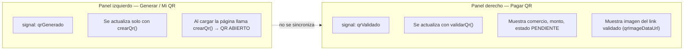

# Sprint 3 — Diagrama de flujos (Pagos QR)

## Flujo 1: Generación de QR (abierto vs fijo)

```mermaid
flowchart TD
    A[PagosQrPage.crearQr] --> B{tipoQr?}

    B -->|ABIERTO| C["POST /pagos-qr { tipoQr: ABIERTO }"]
    B -->|FIJO| D["POST /pagos-qr { tipoQr: FIJO, comercioId, montoCentavos, expiraMinutos }"]

    C --> E["pagos-qr.service.crear"]
    D --> E

    E --> F["findCuentaPrincipal(usuarioId)"]
    F --> G{Cuenta ACTIVA?}
    G -->|No| ERR1[400/404]

    G --> H{tipo ABIERTO?}
    H -->|Sí| I["findOpenByCuentaDestino"]
    I -->|Ya existe| J[Retornar QR existente enrichQr]
    I -->|No existe| K[Continuar creación]

    H -->|FIJO| L{comercioId y monto > 0?}
    L -->|No| ERR2[400]
    L --> K

    K --> M["signToken({ jti, cuentaDestinoId, tipo, iat })"]
    Note over M: HMAC-SHA256 con QR_SECRET<br/>codigo = ageru://qr/{body}.{sig}

    M --> N["createPagoQr → INSERT pagos_qr PENDIENTE"]
    N --> O["enrichQr → QRCode.toDataURL()"]
    O --> P[Respuesta: codigo_qr + qrImageDataUrl]
    P --> Q[Mostrar imagen QR en UI]
```

---

## Flujo 2: Validación de QR escaneado

```mermaid
flowchart TD
    A[Pagador pega/escanea codigo_qr] --> B["POST /pagos-qr/validar"]
    B --> C["getTokenFromCodigo(codigoQr)"]
    C --> D["verifyToken(token)"]
    D -->|Firma inválida| ERR1[400 QR inválido]
    D --> E["findByCodigo(ageru://qr/{token})"]
    E --> F["expirarPendientes() en repo"]
    Note over F: UPDATE estado=EXPIRADO WHERE expira_en <= NOW AND tipo<>ABIERTO
    E -->|No existe| ERR2[404]
    E --> G[Retornar datos QR + requiereMonto]
    G --> H{tipo_qr === ABIERTO sin monto?}
    H -->|Sí| I[UI muestra campo montoPagoSoles]
    H -->|No| J[UI muestra monto fijo precargado]
```

---

## Flujo 3: Pago de QR

```mermaid
flowchart TD
    A["POST /pagos-qr/pagar { codigoQr, montoCentavos? }"] --> B["pagos-qr.service.pagar"]
    B --> C["validar(codigoQr)"]
    C --> D{estado === PENDIENTE?}
    D -->|No| ERR1[400: QR ya procesado/expirado]
    D --> E["Resolver montoCentavos"]
    E --> F{QR ABIERTO?}
    F -->|Sí| G["Usar payload.montoCentavos"]
    F -->|No| H["Usar monto_centavos del QR"]

    G --> I["findCuentaPrincipal → cuenta origen"]
    H --> I
    I --> J["getSumaTxHoy + validar límite diario"]
    J --> K["pagosQrRepository.pagar()"]

    K --> L[BEGIN TRANSACTION]
    L --> M["SELECT pagos_qr WITH UPDLOCK"]
    M --> N{FIJO expirado?}
    N -->|Sí| RB1[ROLLBACK → QR_EXPIRADO]
    N --> O{Monto coincide FIJO?}
    O -->|No| RB2[ROLLBACK → MONTO_NO_COINCIDE]
    O --> P["UPDATE origen saldo -= monto"]
    P -->|0 rows| RB3[SALDO_INSUFICIENTE]
    P --> Q["UPDATE destino saldo += monto"]
    Q --> R["INSERT transacciones PAGO_QR COMPLETADA"]
    R --> S{tipo FIJO?}
    S -->|Sí| T["UPDATE pagos_qr → PAGADO + transaccion_id"]
    S -->|No ABIERTO| U[QR sigue PENDIENTE]
    T --> V[COMMIT]
    U --> V
    V --> W[JSON comprobante QR-{timestamp}]
```

---

## Flujo 4: Cancelación de QR fijo

```mermaid
flowchart LR
    A[Botón Cancelar en lista] --> B["POST /pagos-qr/:id/cancelar"]
    B --> C["pagosQrRepository.cancelar(id, cuentaDestinoId)"]
    C --> D["UPDATE pagos_qr SET CANCELADO<br/>WHERE estado=PENDIENTE"]
    D --> E[Refrescar lista qrs()]
```

---

## Formato del código QR

```
ageru://qr/{base64url_payload}.{base64url_hmac_sha256}
```

| Campo en payload | QR ABIERTO | QR FIJO |
|------------------|------------|---------|
| `jti` | `cuenta.id` (estable) | `crypto.randomUUID()` (único) |
| `cuentaDestinoId` | ID cuenta receptor | ID cuenta receptor |
| `tipo` | ABIERTO | FIJO |
| `iat` | timestamp ms | timestamp ms |

**Cómo firmar (`signToken`):**
```javascript
const body = Buffer.from(JSON.stringify(payload)).toString('base64url');
const signature = crypto.createHmac('sha256', secret).update(body).digest('base64url');
return `${body}.${signature}`;
```

**Cómo verificar (`verifyToken`):**
```javascript
// Recalcula HMAC y compara con crypto.timingSafeEqual (anti timing-attack)
```

---

## Comportamiento de la UI (`PagosQrPage`)

La pantalla tiene **dos paneles independientes**. Eso explica por qué al validar un link el monto/comercio/estado sí cambian, pero la imagen del panel izquierdo no.



| Acción | Panel izquierdo (`qrGenerado`) | Panel derecho (`qrValidado`) |
|--------|-------------------------------|------------------------------|
| Abrir página | Muestra tu QR **abierto** (auto) | Vacío |
| Generar QR fijo | Muestra imagen del QR fijo creado | No cambia (salvo que copies el link al textarea) |
| Pegar link + **Validar** | **No cambia** — sigue tu QR abierto/fijo del panel izquierdo | Actualiza comercio, monto, estado e **imagen del link pegado** |
| **Pagar** | No cambia | Muestra comprobante de pago |

### ¿El QR cambia según lo que escribes?

| Tipo | ¿Cuándo cambia el enlace/imagen? | ¿Dónde va el monto? |
|------|----------------------------------|---------------------|
| **ABIERTO** | Casi nunca — es permanente por cuenta | Lo ingresa el pagador al pagar |
| **FIJO** | Cada vez que pulsas **Generar QR fijo** (nuevo token UUID) | Queda fijo en BD al generar; no cambia si solo editas el input sin regenerar |

### Detalle técnico (antes del ajuste)

- `POST /pagos-qr` (crear) devolvía `qrImageDataUrl` vía `enrichQr()`.
- `POST /pagos-qr/validar` solo devolvía datos de texto; el frontend guardaba eso en `qrValidado` pero **no pintaba imagen**.
- El panel izquierdo siempre mostraba `qrGenerado`, que al iniciar la página es el QR abierto.

**Corrección aplicada:** `validar()` también llama a `enrichQr()` y el panel **Pagar QR** muestra la imagen del código que validaste, sin tocar el panel izquierdo (que sigue siendo “tu QR para cobrar”).
