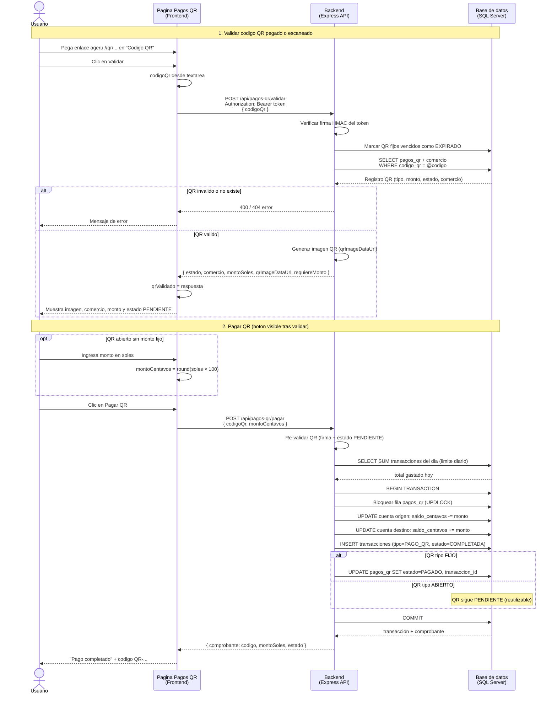
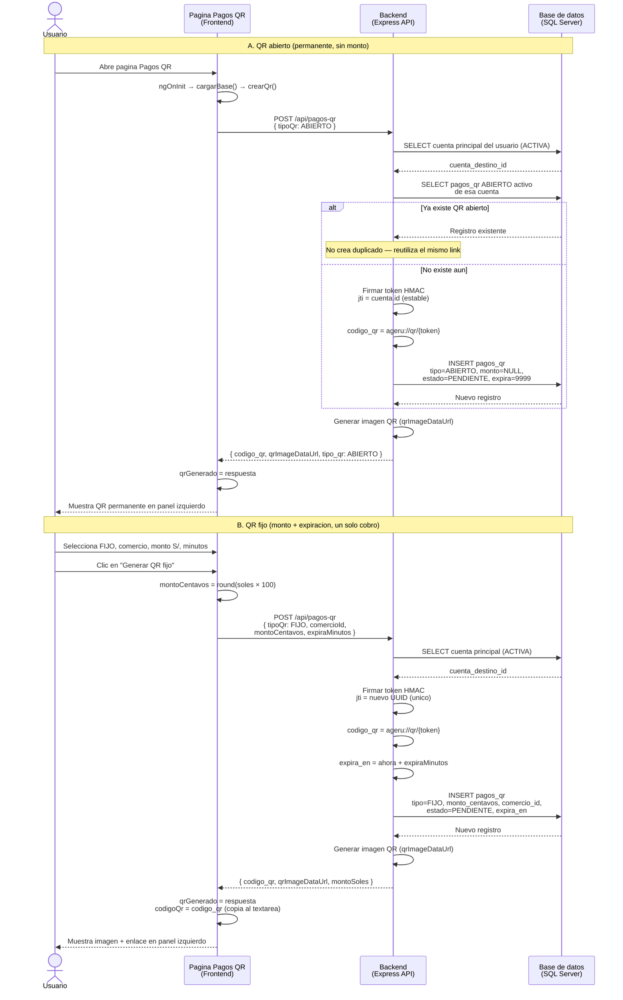
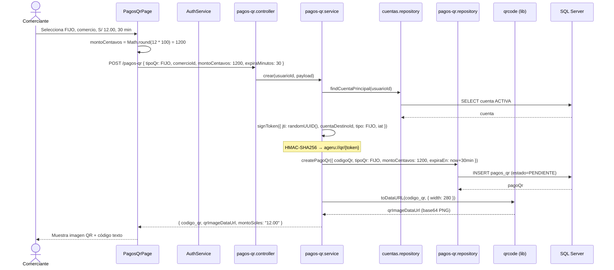
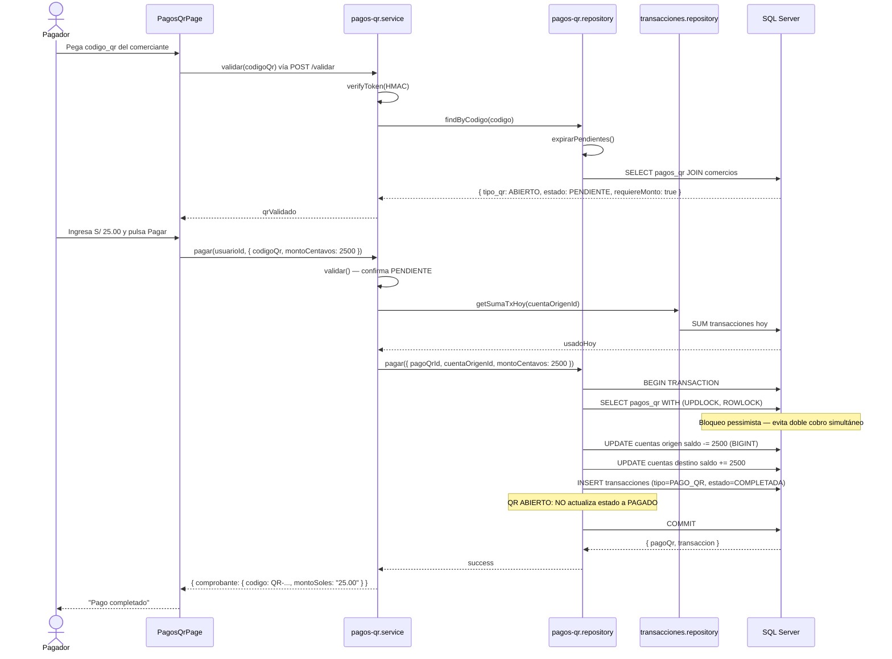
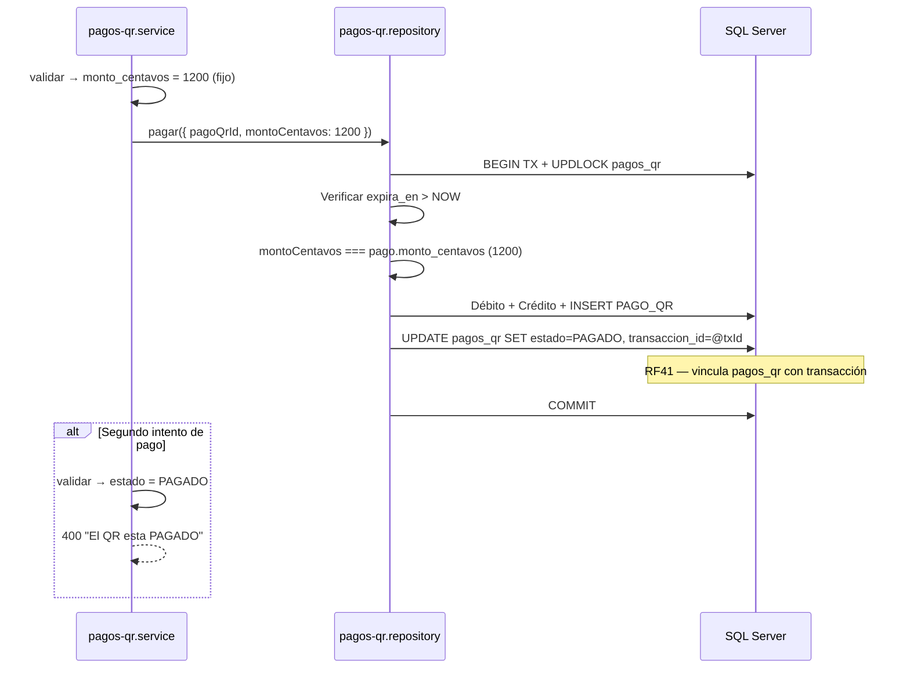
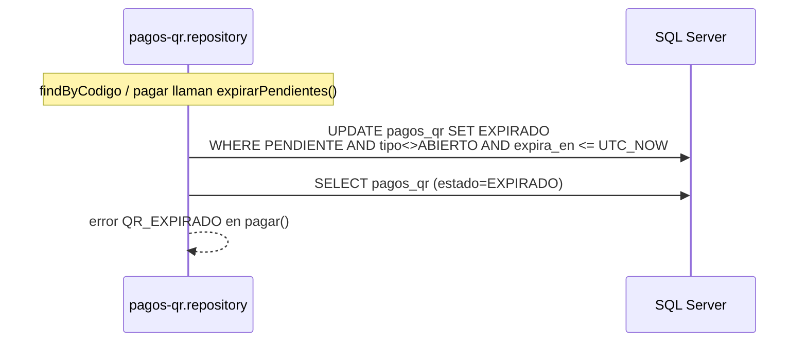

# Sprint 3 — Diagrama de secuencia (Pagos QR)

## Vista simplificada — 4 capas (Usuario, Frontend, Backend, BD)

Diagrama resumido del flujo **validar → pagar** en la pantalla de Pagos QR. El backend agrupa controller, service y repository; la BD representa SQL Server (`pagos_qr`, `cuentas`, `transacciones`).



### Participantes

| Capa | En el codigo | Rol en este flujo |
|------|----------------|-------------------|
| **Usuario** | — | Pega el link, valida, confirma el pago |
| **Pagina Pagos QR** | `pagos-qr.page.ts` | `validarQr()`, `pagarQr()`, muestra `qrValidado` y boton Pagar QR |
| **Backend** | `pagos-qr.controller` → `pagos-qr.service` → `pagos-qr.repository` | Valida token, consulta BD, ejecuta transaccion atomica |
| **Base de datos** | SQL Server | Tablas `pagos_qr`, `cuentas`, `transacciones` |

### Endpoints involucrados

| Paso | Metodo | Ruta |
|------|--------|------|
| Validar | POST | `/api/pagos-qr/validar` |
| Pagar | POST | `/api/pagos-qr/pagar` |

---

## Vista simplificada — Generar codigo QR (4 capas)

Flujo del panel **izquierdo** (“Mi QR abierto” / “Generar QR fijo”). El usuario que genera es quien **recibe** el pago.



### Diferencias al generar

| | QR abierto | QR fijo |
|---|------------|---------|
| **Cuando se genera** | Al abrir la pagina (auto) o "Ver mi QR" | Cada clic en "Generar QR fijo" |
| **Token / enlace** | Casi siempre el mismo (reutiliza si existe) | Nuevo enlace cada vez (UUID nuevo) |
| **Monto en BD** | `NULL` — lo pone quien paga | Fijo en `monto_centavos` |
| **Expiracion** | No expira (`9999-12-31`) | `expira_en` segun minutos elegidos |
| **Panel UI** | Izquierdo (`qrGenerado`) | Izquierdo (`qrGenerado`) |

### Endpoint

| Paso | Metodo | Ruta |
|------|--------|------|
| Generar QR | POST | `/api/pagos-qr` |

### En el codigo

| Paso | Donde |
|------|--------|
| Usuario pulsa generar | `pagos-qr.page.ts` → `crearQr()` |
| API recibe peticion | `pagos-qr.controller.crear` → `pagos-qr.service.crear` |
| Firma del enlace | `signToken()` — HMAC-SHA256 sobre payload JSON |
| Guardar en BD | `pagos-qr.repository.createPagoQr` |
| Imagen del QR | `enrichQr()` → libreria `qrcode` → `qrImageDataUrl` |

> El enlace generado (`ageru://qr/...`) es lo que el pagador pega en el panel derecho para **Validar** y **Pagar** (diagrama anterior).

---

## Secuencia: Generar QR fijo y mostrar imagen



---

## Secuencia: Pagar QR abierto (pagador ingresa monto)



---

## Secuencia: Pagar QR fijo (monto predefinido, marca PAGADO)



---

## Secuencia: QR fijo expirado



## Referencia de funciones

| Función | Archivo | Qué hace al llamarla |
|---------|---------|----------------------|
| `crear()` | `pagos-qr.service.js` | Valida tipo, firma token, INSERT BD, genera imagen QR |
| `signToken()` | `pagos-qr.service.js` | JSON → base64url + HMAC-SHA256 con `process.env.QR_SECRET` |
| `verifyToken()` | `pagos-qr.service.js` | Recalcula firma; retorna payload parseado o `null` |
| `enrichQr()` | `pagos-qr.service.js` | Añade `montoSoles` y `qrImageDataUrl` vía `QRCode.toDataURL` |
| `validar()` | `pagos-qr.service.js` | Cadena: verifyToken → findByCodigo → flags `requiereMonto` |
| `pagar()` | `pagos-qr.service.js` | validar + límite diario + delega a repository |
| `pagar()` | `pagos-qr.repository.js` | TX SQL completa con UPDLOCK; FIJO→PAGADO, ABIERTO→sigue PENDIENTE |
| `expirarPendientes()` | `pagos-qr.repository.js` | Job implícito: marca EXPIRADO los QR fijos vencidos |
| `cancelar()` | `pagos-qr.repository.js` | UPDATE a CANCELADO solo si PENDIENTE y es del dueño |

## Diferencia clave: ABIERTO vs FIJO

```
┌─────────────┬──────────────────┬─────────────────────┐
│             │ QR ABIERTO       │ QR FIJO             │
├─────────────┼──────────────────┼─────────────────────┤
│ Monto       │ Lo pone pagador  │ Predefinido         │
│ Expira      │ Nunca (9999)     │ expiraMinutos       │
│ Tras pago   │ Sigue PENDIENTE  │ Estado → PAGADO     │
│ Reutilizable│ Sí, ilimitado    │ No (un solo uso)    │
│ comercioId  │ null             │ Requerido           │
└─────────────┴──────────────────┴─────────────────────┘
```
