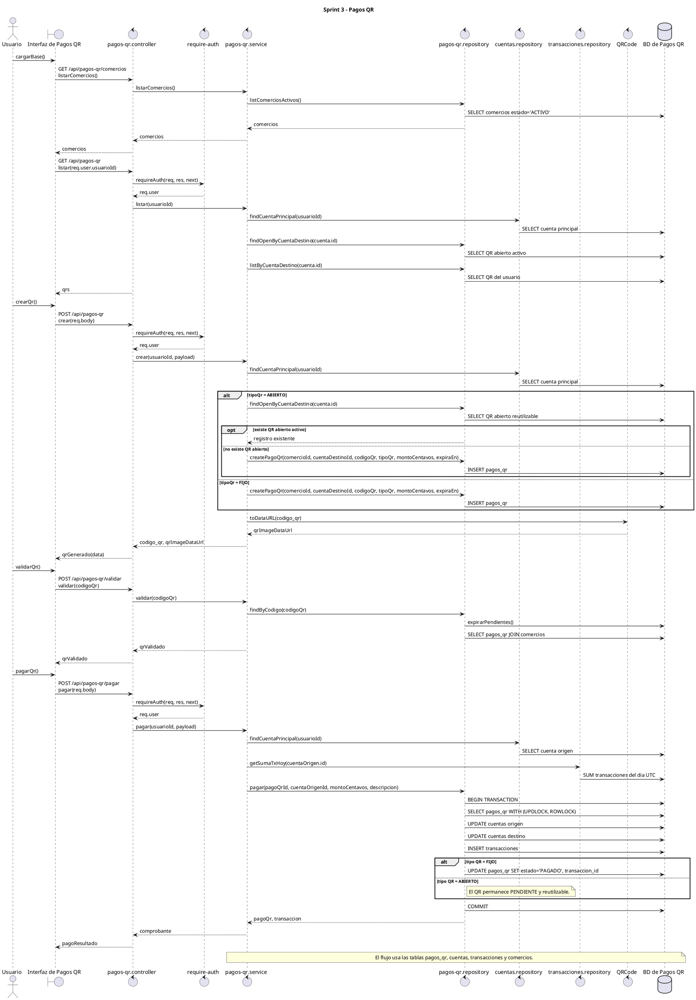

# Sprint 3 - Diagrama de secuencia UML

Flujo principal de Pagos QR con generacion, validacion y pago.

```plantuml
@startuml
title Sprint 3 - Pagos QR

actor Usuario as U
boundary "Interfaz de Pagos QR" as UI
control "pagos-qr.controller" as PC
control "require-auth" as MW
control "pagos-qr.service" as PS
control "pagos-qr.repository" as PR
control "cuentas.repository" as CR
control "transacciones.repository" as TR
control "QRCode" as QR
database "BD de Pagos QR" as DB

U -> UI : cargarBase()
UI -> PC : GET /api/pagos-qr/comercios\nlistarComercios()
PC -> PS : listarComercios()
PS -> PR : listComerciosActivos()
PR -> DB : SELECT comercios estado='ACTIVO'
PR --> PS : comercios
PS --> PC : comercios
PC --> UI : comercios

UI -> PC : GET /api/pagos-qr\nlistar(req.user.usuarioId)
PC -> MW : requireAuth(req, res, next)
MW --> PC : req.user
PC -> PS : listar(usuarioId)
PS -> CR : findCuentaPrincipal(usuarioId)
CR -> DB : SELECT cuenta principal
PS -> PR : findOpenByCuentaDestino(cuenta.id)
PR -> DB : SELECT QR abierto activo
PS -> PR : listByCuentaDestino(cuenta.id)
PR -> DB : SELECT QR del usuario
PC --> UI : qrs

U -> UI : crearQr()
UI -> PC : POST /api/pagos-qr\ncrear(req.body)
PC -> MW : requireAuth(req, res, next)
MW --> PC : req.user
PC -> PS : crear(usuarioId, payload)
PS -> CR : findCuentaPrincipal(usuarioId)
CR -> DB : SELECT cuenta principal

alt tipoQr = ABIERTO
  PS -> PR : findOpenByCuentaDestino(cuenta.id)
  PR -> DB : SELECT QR abierto reutilizable
  opt existe QR abierto activo
    PR --> PS : registro existente
  else no existe QR abierto
    PS -> PR : createPagoQr(comercioId, cuentaDestinoId, codigoQr, tipoQr, montoCentavos, expiraEn)
    PR -> DB : INSERT pagos_qr
  end
else tipoQr = FIJO
  PS -> PR : createPagoQr(comercioId, cuentaDestinoId, codigoQr, tipoQr, montoCentavos, expiraEn)
  PR -> DB : INSERT pagos_qr
end

PS -> QR : toDataURL(codigo_qr)
QR --> PS : qrImageDataUrl
PS --> PC : codigo_qr, qrImageDataUrl
PC --> UI : qrGenerado(data)

U -> UI : validarQr()
UI -> PC : POST /api/pagos-qr/validar\nvalidar(codigoQr)
PC -> PS : validar(codigoQr)
PS -> PR : findByCodigo(codigoQr)
PR -> DB : expirarPendientes()
PR -> DB : SELECT pagos_qr JOIN comercios
PS --> PC : qrValidado
PC --> UI : qrValidado

U -> UI : pagarQr()
UI -> PC : POST /api/pagos-qr/pagar\npagar(req.body)
PC -> MW : requireAuth(req, res, next)
MW --> PC : req.user
PC -> PS : pagar(usuarioId, payload)
PS -> CR : findCuentaPrincipal(usuarioId)
CR -> DB : SELECT cuenta origen
PS -> TR : getSumaTxHoy(cuentaOrigen.id)
TR -> DB : SUM transacciones del dia UTC
PS -> PR : pagar(pagoQrId, cuentaOrigenId, montoCentavos, descripcion)
PR -> DB : BEGIN TRANSACTION
PR -> DB : SELECT pagos_qr WITH (UPDLOCK, ROWLOCK)
PR -> DB : UPDATE cuentas origen
PR -> DB : UPDATE cuentas destino
PR -> DB : INSERT transacciones

alt tipo QR = FIJO
  PR -> DB : UPDATE pagos_qr SET estado='PAGADO', transaccion_id
else tipo QR = ABIERTO
  note right of PR
    El QR permanece PENDIENTE y reutilizable.
  end note
end

PR -> DB : COMMIT
PR --> PS : pagoQr, transaccion
PS --> PC : comprobante
PC --> UI : pagoResultado

note over PS,DB
El flujo usa las tablas pagos_qr, cuentas, transacciones y comercios.
end note
@enduml
```
