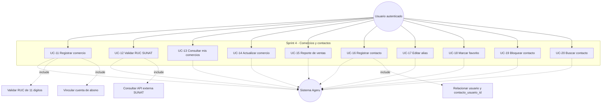

# Sprint 4 - Diagrama de casos de uso

**Objetivo del sprint:** registro y validacion de comercios por RUC, junto con la base funcional para la agenda de contactos.

## Mapeo tecnico

| Caso de uso | Frontend | Backend |
|------------|----------|---------|
| Registrar comercio | `frontend/src/app/features/comercios/pages/comercios.page.ts` | `POST /api/comercios` |
| Validar RUC SUNAT | `frontend/src/app/features/comercios/pages/comercios.page.ts` | `GET /api/comercios/validar-ruc/:ruc` |
| Consultar mis comercios | `frontend/src/app/features/comercios/pages/comercios.page.ts` | `GET /api/comercios` |
| Actualizar comercio | `frontend/src/app/features/comercios/pages/comercios.page.ts` | `PUT /api/comercios/:id` |
| Reporte de ventas | `frontend/src/app/features/comercios/pages/comercios.page.ts` | `GET /api/comercios/reportes/ventas` |
| Agenda de contactos | No implementado | No implementado |

## Observacion

El modulo de comercios ya existe en frontend y backend. La agenda de contactos, en cambio, solo aparece en el esquema SQL y todavia no tiene API ni pantalla propia.
