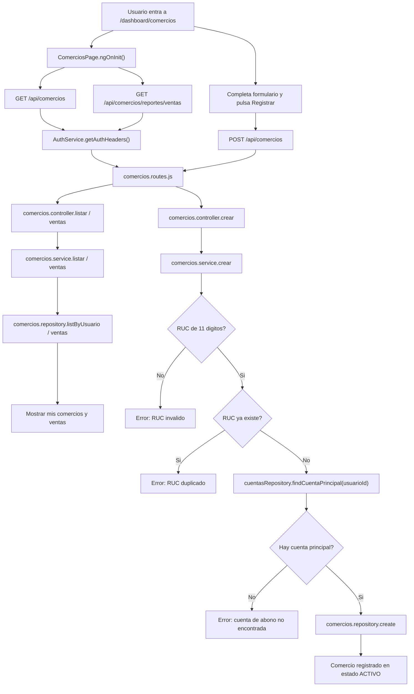
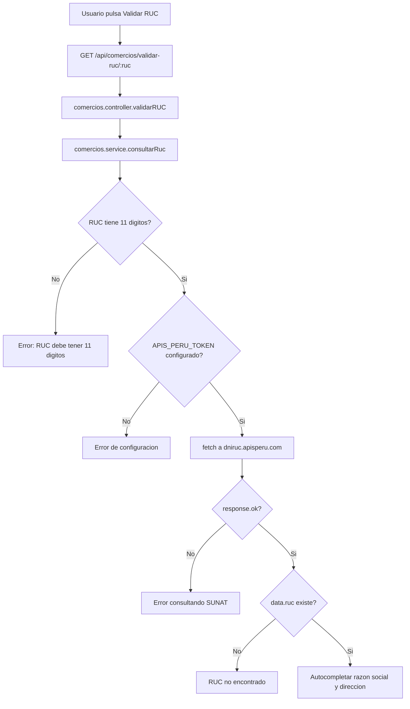
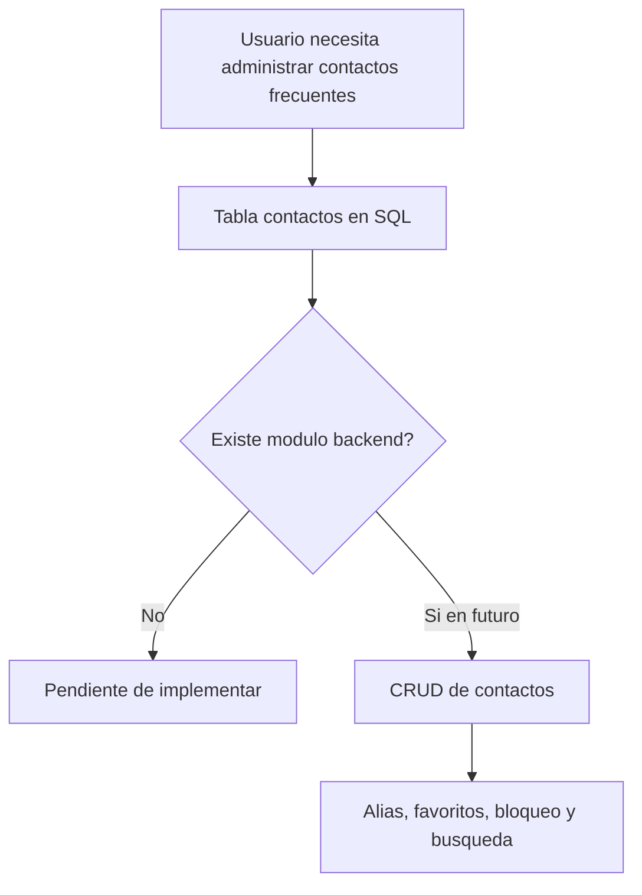

# Sprint 4 - Diagrama de flujos

## Flujo 1: consultar y registrar comercio

## Flujo 2: validar RUC con API externa

## Flujo 3: agenda de contactos

## Puntos tecnicos

- Comercios usa `AuthService.getAuthHeaders()` para proteger las rutas.
- La cuenta de abono se toma de `cuentasRepository.findCuentaPrincipal(usuarioId)`.
- La validacion de RUC depende de `APIS_PERU_TOKEN` y del servicio externo `dniruc.apisperu.com`.
- La agenda de contactos aun no tiene capa de backend ni vista frontend.
