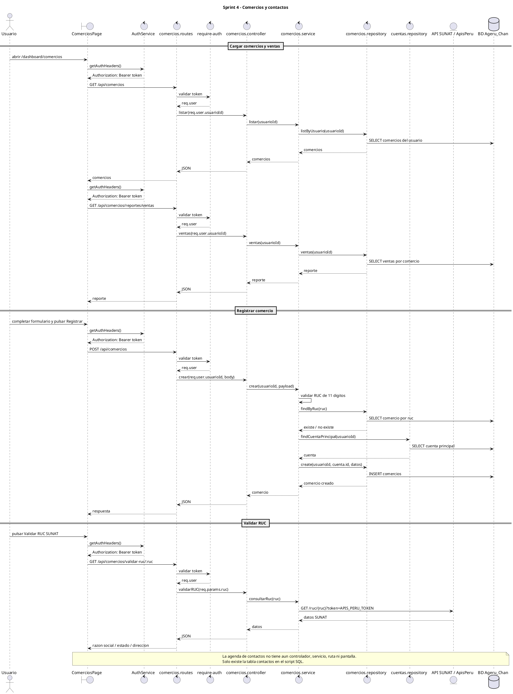

# Sprint 4 - Diagrama de secuencia UML

Flujo real de comercios ya implementado en el codigo, con la agenda de contactos como pendiente.

```plantuml
@startuml
title Sprint 4 - Comercios y contactos

actor Usuario as U
boundary "ComerciosPage" as UI
control "AuthService" as AS
control "comercios.routes" as RT
control "require-auth" as MW
control "comercios.controller" as CC
control "comercios.service" as CS
control "comercios.repository" as CR
control "cuentas.repository" as CT
entity "API SUNAT / ApisPeru" as API
database "BD Ageru_Chan" as DB

== Cargar comercios y ventas ==
U -> UI : abrir /dashboard/comercios
UI -> AS : getAuthHeaders()
AS --> UI : Authorization: Bearer token
UI -> RT : GET /api/comercios
RT -> MW : validar token
MW --> RT : req.user
RT -> CC : listar(req.user.usuarioId)
CC -> CS : listar(usuarioId)
CS -> CR : listByUsuario(usuarioId)
CR -> DB : SELECT comercios del usuario
CR --> CS : comercios
CS --> CC : comercios
CC --> RT : JSON
RT --> UI : comercios

UI -> AS : getAuthHeaders()
AS --> UI : Authorization: Bearer token
UI -> RT : GET /api/comercios/reportes/ventas
RT -> MW : validar token
MW --> RT : req.user
RT -> CC : ventas(req.user.usuarioId)
CC -> CS : ventas(usuarioId)
CS -> CR : ventas(usuarioId)
CR -> DB : SELECT ventas por comercio
CR --> CS : reporte
CS --> CC : reporte
CC --> RT : JSON
RT --> UI : reporte

== Registrar comercio ==
U -> UI : completar formulario y pulsar Registrar
UI -> AS : getAuthHeaders()
AS --> UI : Authorization: Bearer token
UI -> RT : POST /api/comercios
RT -> MW : validar token
MW --> RT : req.user
RT -> CC : crear(req.user.usuarioId, body)
CC -> CS : crear(usuarioId, payload)
CS -> CS : validar RUC de 11 digitos
CS -> CR : findByRuc(ruc)
CR -> DB : SELECT comercio por ruc
CR --> CS : existe / no existe
CS -> CT : findCuentaPrincipal(usuarioId)
CT -> DB : SELECT cuenta principal
CT --> CS : cuenta
CS -> CR : create(usuarioId, cuenta.id, datos)
CR -> DB : INSERT comercios
CR --> CS : comercio creado
CS --> CC : comercio
CC --> RT : JSON
RT --> UI : respuesta

== Validar RUC ==
U -> UI : pulsar Validar RUC SUNAT
UI -> AS : getAuthHeaders()
AS --> UI : Authorization: Bearer token
UI -> RT : GET /api/comercios/validar-ruc/:ruc
RT -> MW : validar token
MW --> RT : req.user
RT -> CC : validarRUC(req.params.ruc)
CC -> CS : consultarRuc(ruc)
CS -> API : GET /ruc/{ruc}?token=APIS_PERU_TOKEN
API --> CS : datos SUNAT
CS --> CC : datos
CC --> RT : JSON
RT --> UI : razon social / estado / direccion

note over UI,DB
La agenda de contactos no tiene aun controlador, servicio, ruta ni pantalla.
Solo existe la tabla contactos en el script SQL.
end note

@enduml
```
